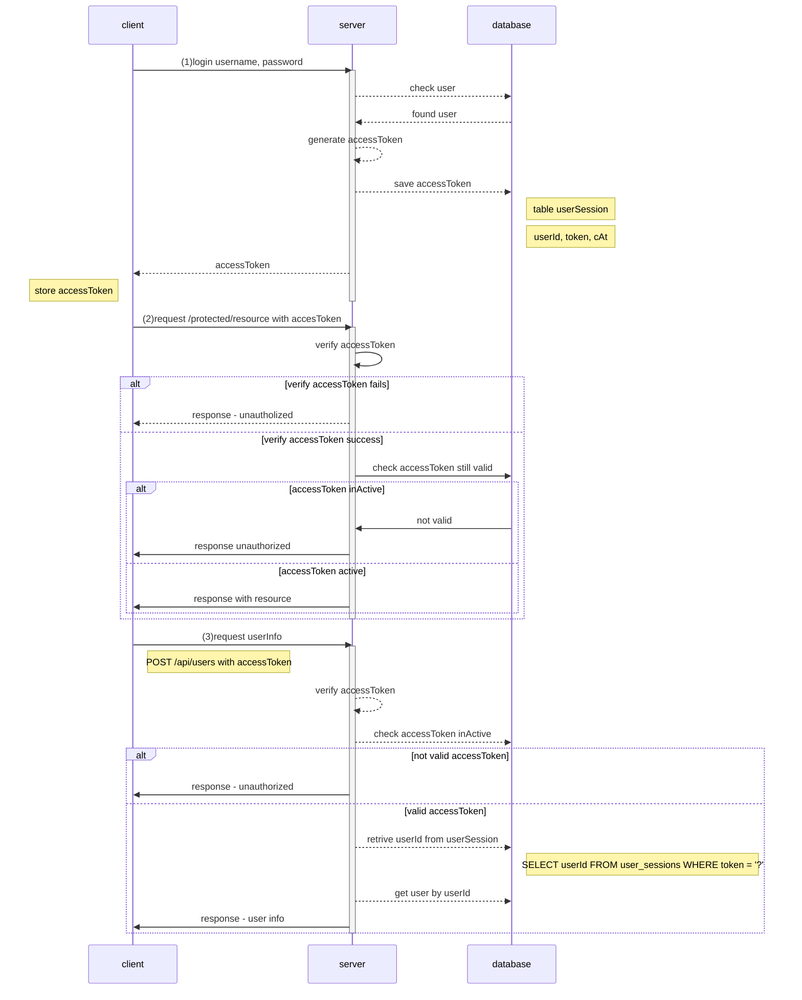

```mermaid

sequenceDiagram
  client->>server: (1)login username, password

  activate server
  server-->>database: check user
  database-->>server: found user
  server-->>server: generate accessToken
  server-->>database: save accessToken
  Note right of database: table userSession
  Note right of database: userId, token, cAt
  server-->>client: accessToken
  Note left of client: store accessToken
  deactivate server

  client->>server: (2)request /protected/resource with accesToken
  activate server
  server->>server: verify accessToken
  alt verify accessToken fails
    server-->>client: response - unautholized
  else verify accessToken success
    server->>database: check accessToken still valid
    alt accessToken inActive
    database->>server: not valid
    server->>client: response unauthorized
    else accessToken active
    server->>client: response with resource
    end
  end
  deactivate server

  client->>server: (3)request userInfo
  activate server
  Note right of client:  POST /api/users with accessToken

  server-->>server: verify accessToken
  server-->>database: check accessToken inActive
  alt not valid accessToken
    server->>client: response - unauthorized
  else valid accessToken
    server-->>database: retrive userId from userSession
    Note right of database: SELECT userId FROM user_sessions WHERE token = '?'
    server-->>database: get user by userId
    server->>client: response - user info
  end

  deactivate server

```
