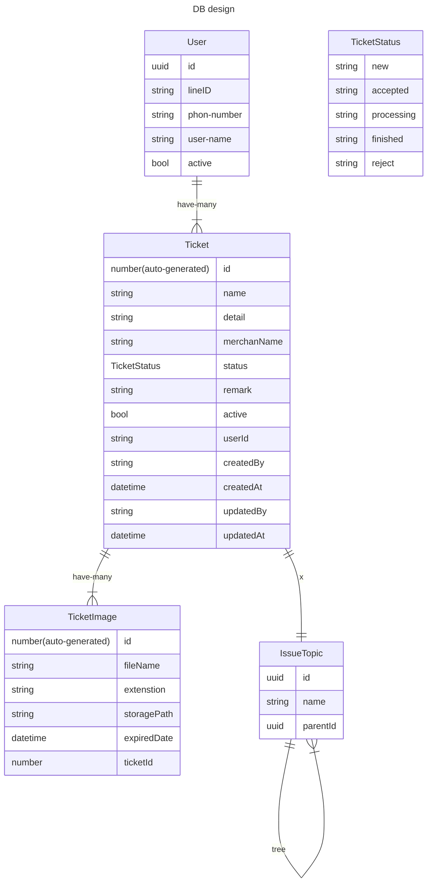

```mermaid
---
title: DB design
---
erDiagram
    User {
      uuid id
      string lineID
      string phon-number
      string user-name
      bool active
    }

    Ticket {
      number(auto-generated) id
      string name
      string detail
      string merchanName
      TicketStatus status
      string remark
      bool active

      string userId

      string createdBy
      datetime createdAt
      string updatedBy
      datetime updatedAt
    }


    TicketStatus {
      string new
      string accepted
      string processing
      string finished
      string reject
    }

    TicketImage {
      number(auto-generated) id
      string fileName
      string extenstion
      string storagePath
      datetime expiredDate

      number ticketId
    }

    IssueTopic {
      uuid id
      string name
      uuid parentId
    }

    IssueTopic ||--|{ IssueTopic : tree
    User ||--|{ Ticket : have-many
    Ticket ||--|{ TicketImage : have-many
    Ticket ||--|| IssueTopic : x
```
